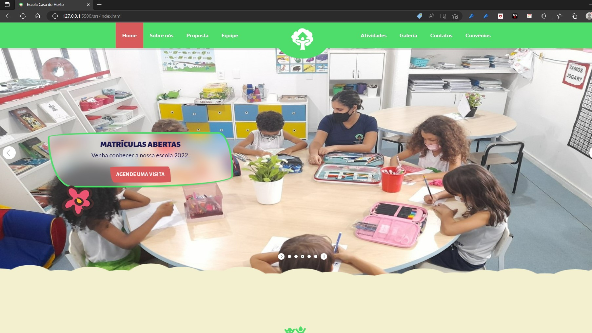
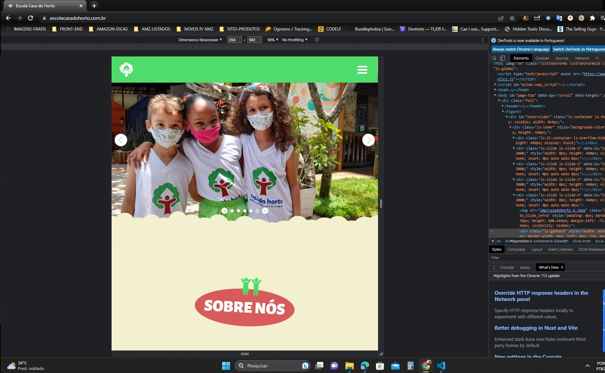

# SITE PRODUZIDO PARA A ESCOLA CASA DO HORTO

Link: www.escolacasadohorto.com.br

## Objetivo
+ Site desenvolvido para melhorar a comunicação entre a escola e a comunidade escolar. Site entregue ao cliente em maio de 2022.

## TECNOLOGIAS UTILIZADAS

Utilizamos, como base estética e funcional, o sitsema de grade pré-criado do BOOTSTRAP da Envato e de autoria de Ingrid Kuhn. Através deste pré-projeto, criamos e recriamos algumas composições e elementos de códigos no intuito de deixar o projeto mais próximo da identidade da escola:

- HTML - 
- CSS - 
- BOOTSTRAP - 
- JAVASCRIPT - para algumas readequações de códigos e para outras requisições e encaminhamentos (enviando e recuperando dados de forma assíncrona) - 
- PHP - PHPMailer - 

## Observações

Com esse projeto, consegui compreender e desenvolver uma noção mais objetiva da imensa possibilidade dos recursos do CSS, da estruturação do JS na sua aplicabilidade, dando uma dinamicidade na arquitetura do projeto. Foi importante também projetar toda estrutura de arquitetura responsiva para as duversas utilizações (web, mobile, talbet, etc).

