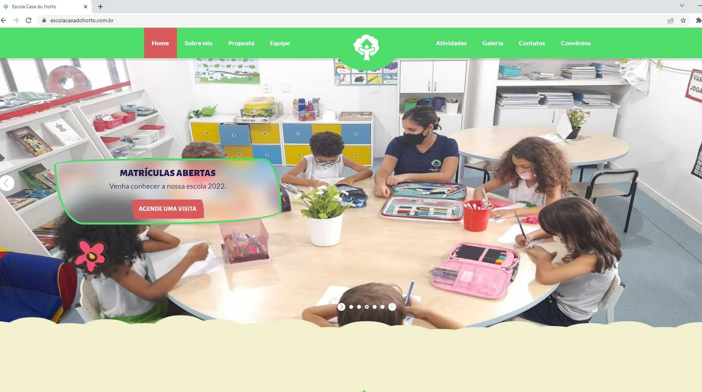

## Site desenvolvido para a Escola Casa do Horto Educação Bilíngue.

## Minha primeira experiencia profissional. :octocat: 

### Criado a partir de um template referência e utilizadas algumas tecnologias:

 
    
    
    
    
    

##

<!--
**danilovviana/escolacasadohorto** é um repositório ✨ importante pra mim_ ✨ porque este arquivo é a divulgação de um trabalho realizado profissionalmente.
